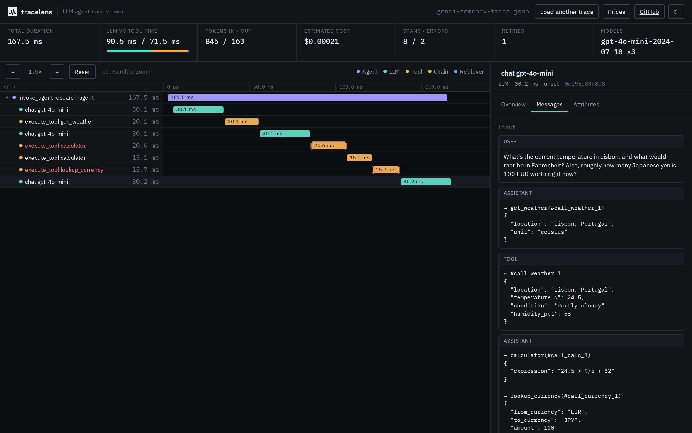
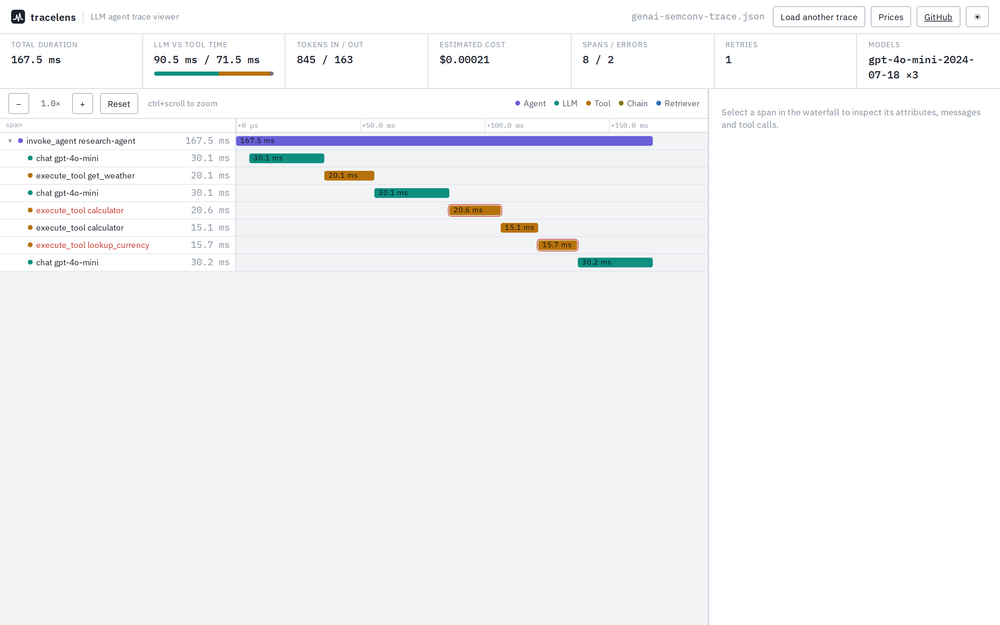
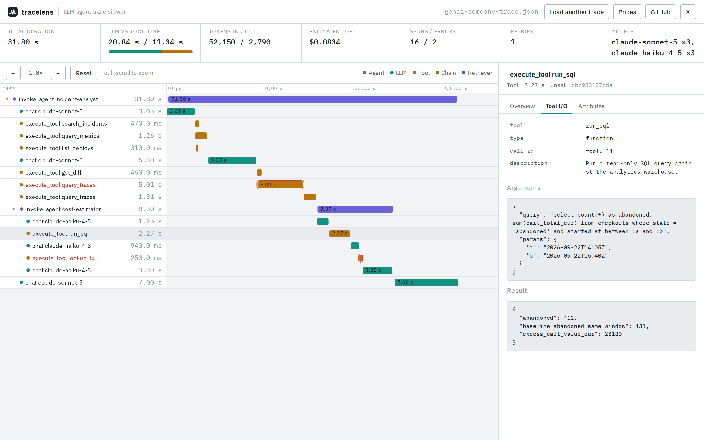
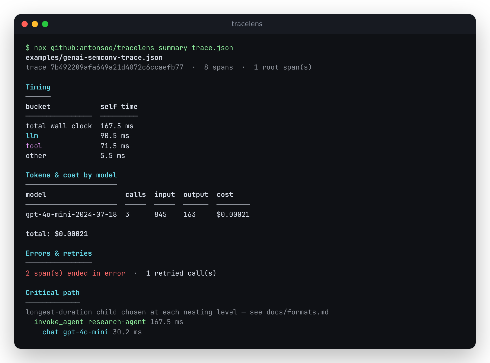

# tracelens

**A zero-install viewer for LLM agent traces.** Drop an OpenTelemetry export,
see every model call, tool call, token and dollar on a timeline.

[](LICENSE)
[](https://antonsoo.github.io/tracelens/)

Agent frameworks increasingly emit OpenTelemetry traces using the [GenAI
semantic conventions](https://github.com/open-telemetry/semantic-conventions-genai)
(`gen_ai.*` attributes) or Arize's [OpenInference](https://github.com/Arize-ai/openinference)
conventions. Viewing one of these traces today usually means standing up a
server — Jaeger, Langfuse, Phoenix — for a file you could have opened
locally. tracelens is a static, local-first web app plus a small CLI: point
it at an OTLP/JSON trace file and get an agent-shaped waterfall, a span
tree, per-span prompts and completions, tool calls, token usage and
estimated cost, errors and retries, and a "where did the time and money go"
summary — nothing leaves the browser tab.



## Live demo

**[antonsoo.github.io/tracelens](https://antonsoo.github.io/tracelens/)** —
loads the bundled example trace, or drop in your own OTLP/JSON file. Nothing
is uploaded; parsing happens entirely in your browser.

## Quickstart

```bash
git clone https://github.com/antonsoo/tracelens.git
cd tracelens
npm install && npm run build:web   # builds the static site to dist/
npx vite preview                   # serve it locally
```

Or run the CLI straight from GitHub, without cloning (point it at any
OTLP/JSON trace file of your own — `trace.json` below is a placeholder):

```bash
npx --yes --allow-git=root github:antonsoo/tracelens summary trace.json
```

`--allow-git=root` is required because npm 12+ disables installing from git
by default (`npm config set allow-git true` to opt in permanently instead).
The first run also prints one line — `1 package had install scripts
blocked...` — from a harmless duplicate check after the package has already
built itself; it's cosmetic, not an error (verified end-to-end via a local
`git+file://` remote, since this environment can't push to GitHub — see
`docs/formats.md` if you want the mechanics).

## Screenshots

| | |
|---|---|
|  |  |
| Waterfall + span tree, light mode | Tool I/O detail panel |



## Features

- **OTLP/JSON parser** — resourceSpans → scopeSpans → spans, typed
  `AnyValue` attribute decoding, tree building with graceful handling of
  malformed spans, missing parents and clock skew (see `docs/formats.md`).
- **Two semantic conventions**, read side by side: OpenTelemetry's GenAI
  semconv (`gen_ai.*`, including the legacy per-message-event fallback
  older instrumentation still emits) and OpenInference (`openinference.*`,
  `llm.*`, including its flattened `llm.input_messages.<i>.*` encoding).
- **Waterfall timeline** — spans colored by kind (agent / LLM / tool /
  chain / retriever / …), zoom via the toolbar or ctrl+scroll, pan by
  dragging once zoomed in.
- **Collapsible span tree**, merged into the same rows as the waterfall so
  selection and scrolling never fall out of sync between two panes.
- **Detail panel** — attributes, a pretty-printed message thread (system /
  user / assistant / tool, with tool calls and their results inline), tool
  arguments and results, and span events (exceptions rendered with their
  real captured stack trace).
- **Summary header** — total duration, LLM time vs. tool time (by *self*
  time, not double-counting nested spans), tokens in/out by model, an
  editable-price cost estimate, error and retry counts, and a critical-path
  readout.
- **CLI** (`tracelens summary` / `tracelens tree`) for the same numbers in
  a terminal, e.g. in a CI log.
- Light and dark themes, keyboard-navigable rows, works fully offline once
  loaded, zero telemetry.

## How it works

### Parsing (`src/core/otlp-parser.ts`)

OTLP/JSON's attribute values are a typed union
(`{"stringValue": "..."}`, `{"intValue": "123"}`, `{"arrayValue": {...}}`,
...), not bare JSON — `decodeAnyValue()` decodes all six variants. Spans are
flattened into one array, then linked into a tree by `parentSpanId`; a span
whose parent isn't present in the file becomes a root with a warning
instead of being dropped, and an end time before its start time (clock
skew) is clamped to zero duration rather than propagating a negative number
through every downstream calculation.

### Semantic-convention mapping (`src/core/normalize.ts`)

Both conventions are mapped onto one normalized `GenAiInfo` shape so the UI
never has to branch on "which convention is this." The exact attribute keys
read, with the spec versions and URLs they were checked against, are in
[`docs/formats.md`](docs/formats.md) — including the parts that are easy to
get wrong: `gen_ai.provider.name` vs. the older `gen_ai.system`,
messages-as-a-JSON-string vs. messages-as-structured-attributes (the spec
allows either), and OpenInference's flattened `llm.input_messages.0.message.role`
indexing vs. GenAI's nested-array shape.

### Cost estimation (`src/core/cost.ts`, `src/core/pricing.ts`)

The default price table is either a price checked against the vendor's own
pricing page via WebFetch (cited with URL and check date, right in the
table) or it's absent — no invented numbers. A span's cost is billed at the
matched model's rate, with cache-read/cache-write tokens billed at their
own (usually lower) rate rather than the full input rate. The table is
editable at runtime (**Prices** in the header) and persists to
`localStorage` only.

### Critical path (`src/core/critical-path.ts`)

This is a specific, cheap heuristic, not the formal scheduling-theory
critical path: starting at the trace's longest root, repeatedly descend
into whichever *direct child* has the largest duration. For the common case
— one agent making sequential tool/LLM calls, no concurrency — that's a
reasonable "where the time went" backbone, but it doesn't account for
overlapping siblings and only reports one span per nesting level. Documented
in the code and in `docs/formats.md` rather than oversold in this README.

### Web UI (`src/web/`)

Vite + TypeScript, deliberately with **no framework** — the whole app is a
few hundred lines of DOM manipulation behind a ~15-line observable store
(`src/web/store.ts`); a framework would have been more ceremony than the
problem needs. Trace content (prompts, tool arguments, anything that came
from the dropped file) is rendered through `textContent`/DOM properties
only, never `innerHTML` with interpolated data — see the comment in
`src/web/dom.ts`.

## Usage

**Export a trace from your own app.** With the OpenTelemetry Collector's
file exporter:

```yaml
exporters:
  file:
    path: ./trace.json
service:
  pipelines:
    traces:
      exporters: [file]
```

Or straight from the Python SDK, converting `ExportTraceServiceRequest` to
its OTLP/JSON wire form (see `examples/otel_genai_example.py` for a full
working example, including how to encode typed `AnyValue`s by hand when you
don't have a collector in the loop):

```python
from opentelemetry.sdk.trace import TracerProvider
from opentelemetry.sdk.trace.export import BatchSpanProcessor
# ...export via your OTLP exporter of choice, then convert to OTLP/JSON
```

**Open it.** Drag the file onto the [live demo](https://antonsoo.github.io/tracelens/),
or `npx --allow-git=root github:antonsoo/tracelens summary trace.json` for a
terminal summary.

## Supported conventions

See [`docs/formats.md`](docs/formats.md) for the complete, cited attribute
list. Summary:

| Convention | Status |
|---|---|
| OTLP/JSON wire format | Supported |
| OpenTelemetry GenAI semconv (`gen_ai.*`) | Supported, including the legacy `gen_ai.system` attribute and per-message-event fallback |
| OpenInference (`openinference.*`, `llm.*`) | Supported |
| Jaeger native JSON export | Not supported — convert via the Collector's `jaeger` receiver + `file` exporter |

## Example traces

`examples/genai-semconv-trace.json` and `examples/openinference-trace.json`
are **real [OpenTelemetry Python SDK](https://opentelemetry.io/docs/languages/python/)
output** — real trace/span IDs, real nanosecond timestamps, a real captured
Python stack trace on the two failing spans. The model and tool calls
themselves are **mocked** (this machine has no LLM API keys); the telemetry
format is not. See `examples/README.md` for the full scenario and how to
regenerate them.

## Accuracy and limitations

- The cost estimator is only as good as the price table; unmatched models
  show `—`, never a silently-wrong `$0`.
- "Critical path" is the heuristic described above, not a guarantee of
  optimality under concurrency.
- No virtualization on the waterfall — every visible span is a real DOM
  node. Fine well past the traces this tool was built for (tested to
  20,000 spans, see Performance below); a trace with hundreds of thousands
  of spans will get sluggish before the parser does.
- The waterfall's fixed-width label column doesn't reflow below ~375px; the
  timeline track scrolls horizontally on a phone rather than compressing
  illegibly.
- Jaeger's native JSON export isn't parsed yet (different schema — see
  above).

## Tests

```bash
npm test
```

48 tests across 5 files: OTLP parsing against the two real example fixtures
(tree structure, parent/child linking, error-span counts) plus hand-built
edge cases (missing parents, clock skew, malformed spans); semconv mapping
for both conventions against the real fixtures; the waterfall's time→pixel
layout math (`nsPerPixel`/`timeToX`/`spanRect`/pan-clamping); the cost
calculator (longest-match pricing, cache-token billing, undefined-not-zero
on a miss); and self-time/retry-count/critical-path correctness on the
example trace. Where a check has an independent oracle — the layout math
against hand-computed pixel positions, the cost math against hand-computed
totals — the test does that, rather than asserting against the code's own
output.

**Performance.** A generated 20,001-span trace parses in **~54 ms** on this
box (14 vCPU WSL2 Linux, 48 GB RAM) — see `tests/otlp-parser.test.ts`, which
asserts a generous 1000 ms ceiling to leave headroom for slower CI hardware
without being a meaningless bound.

## Development

```bash
npm install
npm run dev          # web UI, http://localhost:5173
npm run test          # vitest
npm run lint           # eslint
npm run typecheck      # tsc --noEmit, both tsconfigs
npm run build           # dist/ (web) + dist-cli/ (CLI)
```

CI runs are disabled for now, so there's no status badge above.
`.github/workflows/ci.yml` runs install, lint, typecheck, test and build on
push/PR; `.github/workflows/pages.yml` deploys `dist/` to the `gh-pages`
branch. Both mirror the commands above exactly.

## Contributing

See [CONTRIBUTING.md](CONTRIBUTING.md).

## License

[MIT](LICENSE) © 2026 Anton Soloviev
