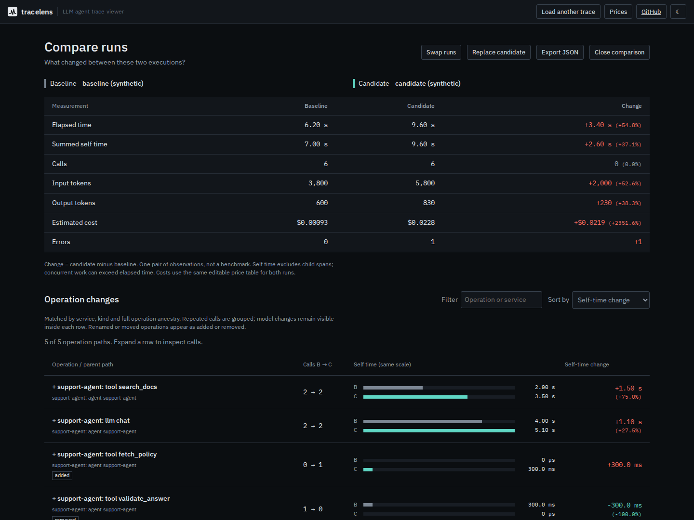
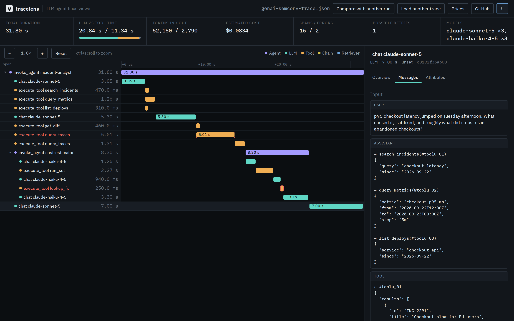
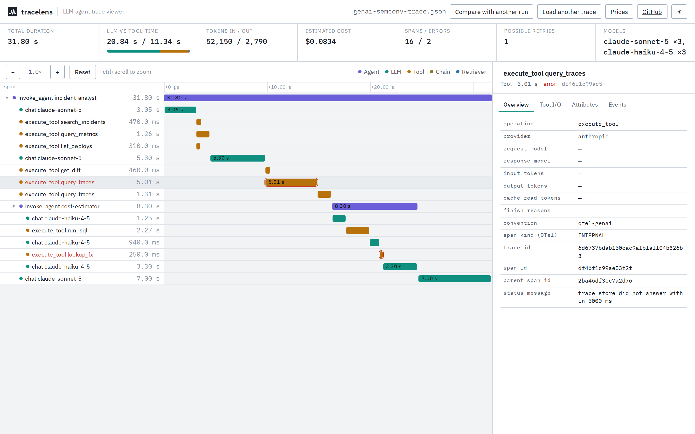
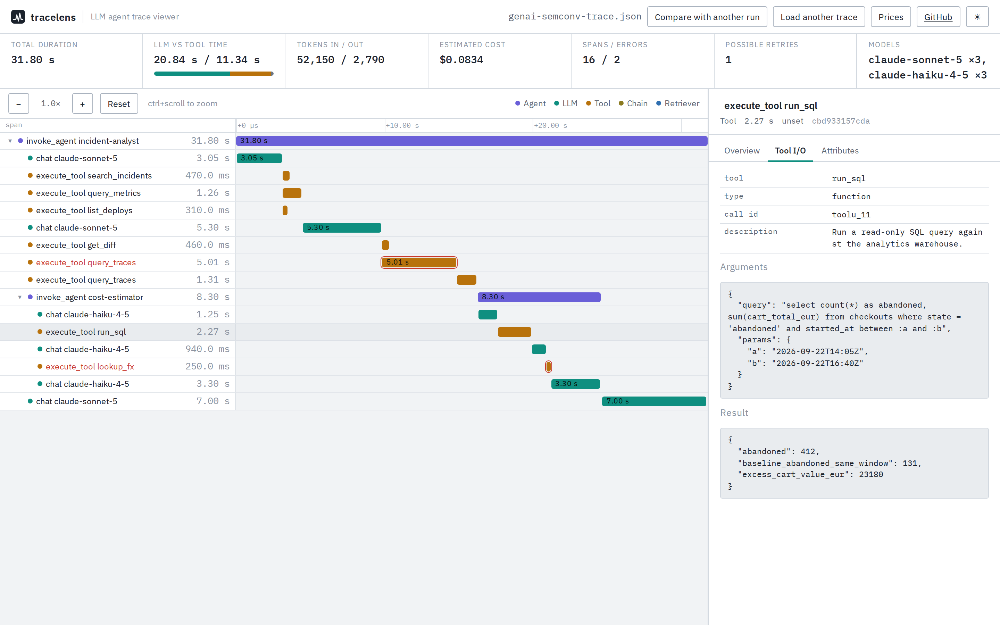
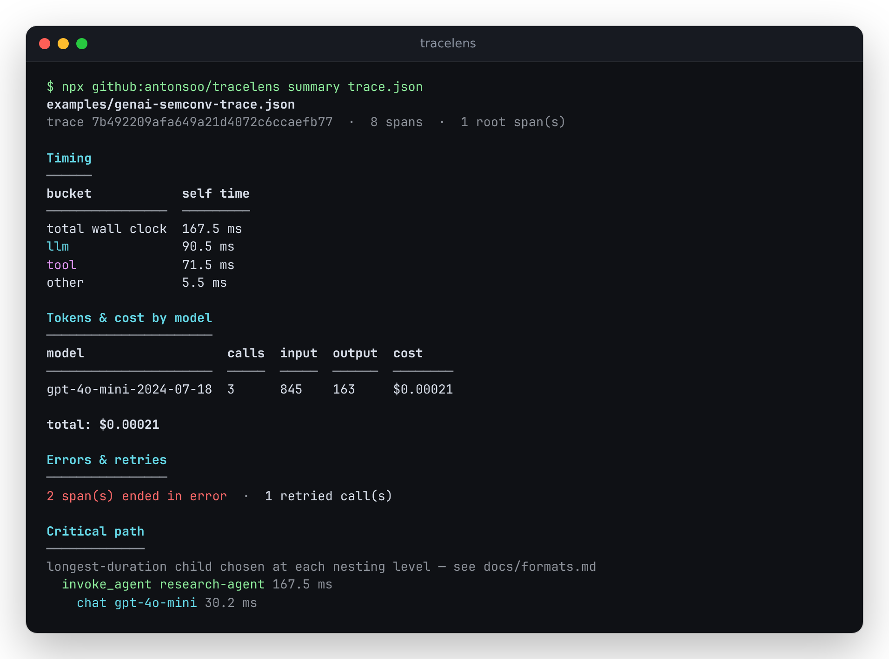

# tracelens

**A zero-install viewer for LLM agent traces.** Drop an OpenTelemetry export,
see every model call, tool call, token and dollar on a timeline.

[](LICENSE)
[](https://antonsoo.github.io/tracelens/)

Agent frameworks increasingly emit OpenTelemetry traces using the [GenAI
semantic conventions](https://github.com/open-telemetry/semantic-conventions-genai)
(`gen_ai.*` attributes) or Arize's [OpenInference](https://github.com/Arize-ai/openinference)
conventions. Viewing one of these traces today usually means standing up a
server — Jaeger, Langfuse, Phoenix — for a file you could have opened
locally. tracelens is a static, local-first web app plus a small CLI: point
it at an OTLP/JSON trace file (or one downloaded from Jaeger) and get an agent-shaped waterfall, a span
tree, per-span prompts and completions, tool calls, token usage and
estimated cost, errors and retries, and a "where did the time and money go"
summary — nothing leaves the browser tab.

**[Compare two runs](https://antonsoo.github.io/tracelens/?example=compare)** to see which operations changed: elapsed time, calls,
tokens, estimated cost and errors, with every aggregate linked back to its
original spans. Repeated calls are grouped by operation path, so inserting
a new model turn does not shift a guessed one-to-one alignment.





## Live demo

**[antonsoo.github.io/tracelens](https://antonsoo.github.io/tracelens/)** —
loads the bundled example trace, or drop in your own OTLP/JSON file. Nothing
is uploaded; parsing happens entirely in your browser.

## Quickstart

```bash
git clone https://github.com/antonsoo/tracelens.git
cd tracelens
npm install && npm run build:web   # builds the static site to dist/
npx vite preview                   # serve it locally
```

Or run the CLI without cloning (point it at any OTLP/JSON or Jaeger JSON
trace of your own; `trace.json` below is a placeholder):

```bash
npx --yes --allow-git=root github:antonsoo/tracelens summary trace.json
```

That installs straight from GitHub: the npm package, `@antonsoloviev/tracelens`,
isn't published yet (npm 12 needs `--allow-git=root` for a git-hosted package).

## Screenshots

| | |
|---|---|
|  |  |
| Waterfall + span tree, light mode | Tool I/O detail panel |



## Features

- **OTLP/JSON parser** — resourceSpans → scopeSpans → spans, typed
  `AnyValue` attribute decoding, tree building with graceful handling of
  malformed spans, missing parents and clock skew (see `docs/formats.md`).
- **A collector's file as it is written** — the OpenTelemetry Collector's
  file exporter writes JSON Lines, one export per batch, and every trace
  that passed through it. The lines are read as one export, and a file with
  several traces gets a picker (`--trace <id>` in the CLI), opening on the
  trace with the most spans.
- **Jaeger JSON too** — a trace downloaded from the Jaeger UI is converted to
  OTLP (microsecond times, typed tags, span kind and status from their tags,
  logs as events) and gets the same checks.
- **Two semantic conventions**, read side by side: OpenTelemetry's GenAI
  semconv (`gen_ai.*`, including the legacy per-message-event fallback
  older instrumentation still emits) and OpenInference (`openinference.*`,
  `llm.*`, including its flattened `llm.input_messages.<i>.*` encoding).
- **Waterfall timeline** — spans colored by kind (agent / LLM / tool /
  chain / retriever / …), zoom via the toolbar or ctrl+scroll, pan by
  dragging once zoomed in. Only the rows in view are rendered, so a trace
  of tens of thousands of spans scrolls and selects like a small one.
- **Collapsible span tree**, merged into the same rows as the waterfall so
  selection and scrolling never fall out of sync between two panes. The
  arrow keys walk it: up and down move, left and right fold and open,
  Home and End jump, Enter selects.
- **Detail panel** — attributes, a pretty-printed message thread (system /
  user / assistant / tool, with tool calls and their results inline), tool
  arguments and results, and span events (exceptions rendered with their
  real captured stack trace).
- **Summary header** — total duration, LLM time vs. tool time (by *self*
  time, not double-counting nested spans), tokens in/out by model, an
  editable-price cost estimate, error and retry counts, and a critical-path
  readout.
- **CLI** (`tracelens summary` / `tracelens tree`) for the same numbers in
  a terminal, e.g. in a CI log. Names taken from the trace are printed
  without their control characters, so a trace cannot send escape sequences
  to the terminal.
- **Run comparison**, in the browser and `tracelens compare`: operation
  groups ranked by absolute self-time change, model changes, added/removed
  operations, per-side span inspection, and JSON export with pricing inputs.
  Missing measurements remain unknown; an unpriced call cannot become a
  claim of cost savings.
- Light and dark themes, works fully offline once loaded, zero telemetry. The page's
  Content-Security-Policy (`connect-src 'self'`) has the browser refuse to send a trace
  anywhere, and nothing but the page's own scripts can run.

## How it works

### Parsing (`src/core/otlp-parser.ts`)

OTLP/JSON's attribute values are a typed union
(`{"stringValue": "..."}`, `{"intValue": "123"}`, `{"arrayValue": {...}}`,
...), not bare JSON — `decodeAnyValue()` decodes all six variants. Spans are
flattened into one array, then linked into a tree by `parentSpanId`; a span
whose parent isn't present in the file becomes a root with a warning
instead of being dropped, and an end time before its start time (clock
skew) is clamped to zero duration rather than propagating a negative number
through every downstream calculation.

### Semantic-convention mapping (`src/core/normalize.ts`)

Both conventions are mapped onto one normalized `GenAiInfo` shape so the UI
never has to branch on "which convention is this." The exact attribute keys
read, with the spec versions and URLs they were checked against, are in
[`docs/formats.md`](docs/formats.md) — including the parts that are easy to
get wrong: `gen_ai.provider.name` vs. the older `gen_ai.system`,
messages-as-a-JSON-string vs. messages-as-structured-attributes (the spec
allows either), and OpenInference's flattened `llm.input_messages.0.message.role`
indexing vs. GenAI's nested-array shape.

### Cost estimation (`src/core/cost.ts`, `src/core/pricing.ts`)

The default price table is either a price checked against the vendor's own
pricing page via WebFetch (cited with URL and check date, right in the
table) or it's absent — no invented numbers. A span's cost is billed at the
matched model's rate, with cache-read/cache-write tokens billed at their
own (usually lower) rate rather than the full input rate. The table is
editable at runtime (**Prices** in the header) and persists to
`localStorage` only.

### Critical path (`src/core/critical-path.ts`)

This is a specific, cheap heuristic, not the formal scheduling-theory
critical path: starting at the trace's longest root, repeatedly descend
into whichever *direct child* has the largest duration. For the common case
— one agent making sequential tool/LLM calls, no concurrency — that's a
reasonable "where the time went" backbone, but it doesn't account for
overlapping siblings and only reports one span per nesting level. Documented
in the code and in `docs/formats.md` rather than oversold in this README.

### Web UI (`src/web/`)

Vite + TypeScript with **no framework**, using DOM components and a small
observable store (`src/web/store.ts`). Trace content (prompts, tool arguments, anything that came
from the dropped file) is rendered through `textContent`/DOM properties
only, never `innerHTML` with interpolated data — see the comment in
`src/web/dom.ts`.

## Usage

### Compare a baseline with a candidate

In the browser, load your baseline and choose **Compare with another run**.
Select the candidate file. Expand an operation to inspect either run's
original calls; use **Back to comparison** to return. **Swap runs** reverses
the comparison, and **Prices** applies the same table to both runs.

To try a reproducible example from the checkout:

```bash
npm ci
npm run build
node dist-cli/cli/index.js compare examples/comparison-baseline.json examples/comparison-candidate.json
```

The example is **hand-authored synthetic telemetry**, with a model change,
a failing search followed by another search, and an added/removed tool:

| Measurement | Baseline | Candidate | Change |
|---|---:|---:|---:|
| Elapsed time | 6.20 s | 9.60 s | +3.40 s |
| Summed self time | 7.00 s | 9.60 s | +2.60 s |
| Input tokens | 3,800 | 5,800 | +2,000 |
| Output tokens | 600 | 830 | +230 |
| Errors | 0 | 1 | +1 |

Search contributes +1.50 s of summed work, and model calls +1.10 s.
The elapsed-time change differs because the baseline's searches overlap
for 0.80 s, while the candidate's searches run sequentially. These are
observations about the example, not a model benchmark or a causal claim.

```bash
node dist-cli/cli/index.js compare examples/comparison-baseline.json examples/comparison-candidate.json --json > comparison.json
```

The versioned JSON includes per-operation measurements, missing-call
counts, original span IDs, model names, parser warnings and the price table
used. It omits prompts, completions, attributes and tool payloads, but
operation names and IDs may still contain information you do not want to
share. [Matching rules and limitations](docs/comparison.md).

### Inspect one trace

**Export a trace from your own app.** With the OpenTelemetry Collector's
file exporter:

```yaml
exporters:
  file:
    path: ./trace.json
service:
  pipelines:
    traces:
      exporters: [file]
```

That file is JSON Lines: the exporter appends one export per batch, so a
run of any length is several lines, and every trace the collector saw is
in it. tracelens reads it as it is. When it holds more than one trace, the
web app shows a picker above the summary, and the CLI lists the traces with
the flag that reads each:

```
$ tracelens summary trace.json
trace.json
trace 6d6737bdab150eac9afbfaff04b326b3  ·  16 spans  ·  1 root span(s)
3 traces in this file; showing 6d6737bdab150eac9afbfaff04b326b3 (invoke_agent incident-analyst, 16 spans, 31.80 s)
  also: aaaaaaaaaaaaaaaaaaaaaaaaaaaaaaaa (support-agent, 6 spans, 6.20 s)   --trace aaaaaaaa
  also: bbbbbbbbbbbbbbbbbbbbbbbbbbbbbbbb (support-agent, 6 spans, 9.60 s)   --trace bbbbbbbb
...
```

(The file here is the bundled GenAI example in two batches, with the two
synthetic comparison runs between them.)

`tracelens compare runs.json runs.json --baseline-trace aaaaaaaa --candidate-trace bbbbbbbb`
compares two runs out of the same file.

Or straight from the Python SDK, converting `ExportTraceServiceRequest` to
its OTLP/JSON wire form (see `examples/otel_genai_example.py` for a full
working example, including how to encode typed `AnyValue`s by hand when you
don't have a collector in the loop):

```python
from opentelemetry.sdk.trace import TracerProvider
from opentelemetry.sdk.trace.export import BatchSpanProcessor
# ...export via your OTLP exporter of choice, then convert to OTLP/JSON
```

**Open it.** Drag the file onto the [live demo](https://antonsoo.github.io/tracelens/),
or `npx --allow-git=root github:antonsoo/tracelens summary trace.json` for a
terminal summary.

## Supported conventions

See [`docs/formats.md`](docs/formats.md) for the complete, cited attribute
list. Summary:

| Convention | Status |
|---|---|
| OTLP/JSON wire format | Supported: one document, or JSON Lines with an export per line (the Collector's file exporter) |
| OpenTelemetry GenAI semconv (`gen_ai.*`) | Supported, including the legacy `gen_ai.system` attribute and per-message-event fallback. Checked on spans written by OpenLLMetry 0.62.4 |
| OpenInference (`openinference.*`, `llm.*`) | Supported: multi-part contents, tool calls and tool results as the instrumentation libraries write them. Checked on spans written by `openinference-instrumentation-anthropic` 3.0.1 and `-openai` 0.1.63 |
| Jaeger native JSON export | Supported: converted to OTLP/JSON, then parsed the same way; a search result with several traces is read one trace at a time |

## Example traces

`examples/genai-semconv-trace.json` and `examples/openinference-trace.json`
are **real [OpenTelemetry Python SDK](https://opentelemetry.io/docs/languages/python/)
output**: real trace/span IDs, parent/child links and captured Python stack
traces on the failing spans. The model and tool calls are **mocked** (this
machine has no LLM API keys), and the GenAI trace's timings are set
explicitly to realistic values; the telemetry format itself is not mocked.
The default example is a 16-span, 31.8-second incident-analysis agent run
with parallel tool calls, a retried timeout, a sub-agent on a cheaper model
and one permanent tool failure. See `examples/README.md` for the full
scenario and how to regenerate them. `examples/jaeger-genai-trace.json` is
the same trace in Jaeger's JSON, written by `scripts/otlp-to-jaeger.mjs`.

## Accuracy and limitations

- The viewer and comparison read **one trace at a time**; a file with
  several is read for the one you pick. Comparison groups by service namespace,
  service name, kind and full operation ancestry; renaming or reparenting
  an operation produces an added/removed group. Repeated calls in a group
  are not individually paired, and a pair of runs does not establish
  statistical significance. See [comparison details](docs/comparison.md).

- The cost estimator is only as good as the price table; unmatched models
  show `—`, never a silently-wrong `$0`.
- Incomplete or invalid token counts leave costs unknown. Single-run
  totals label partial costs as subtotals. Cache counts must be included
  in total input; billing details beyond the token price table are not modeled.
- Possible retries are inferred from a new tool call after a failed,
  completed call with the same name and parent. Repetition alone is not a retry.
- "Critical path" is the heuristic described above, not a guarantee of
  optimality under concurrency.
- The browser takes files up to 25 MB, and reads a file whole: a
  collector file larger than that needs splitting first.
- JSON Lines is read for OTLP only. Jaeger's JSON is one document.
- The waterfall's fixed-width label column doesn't reflow below ~375px; the
  timeline track scrolls horizontally on a phone rather than compressing
  illegibly.

## Tests

```bash
npm test
```

The core test suite covers OTLP parsing against the two real example fixtures
(tree structure, parent/child linking, error-span counts) plus hand-built
edge cases (missing parents, clock skew, malformed spans); semconv mapping
for both conventions against the real fixtures; the waterfall's time→pixel
layout math (`nsPerPixel`/`timeToX`/`spanRect`/pan-clamping); the cost
calculator (longest-match pricing, cache-token billing, undefined-not-zero
on a miss); and self-time/retry-count/critical-path correctness on the
example trace. Where a check has an independent oracle — the layout math
against hand-computed pixel positions, the cost math against hand-computed
totals — the test does that, rather than asserting against the code's own
output. Comparison adds operation matching, missing-measurement coverage,
structural validation and interval-union checks against an independent
occupancy oracle. `npm run test:cli` checks the built executable;
`npm run test:browser` exercises the real interface after a build.

**Performance.** A generated 20,001-span trace parses in **~65 ms** once
warm on this box (14 vCPU WSL2 Linux, 48 GB RAM; about 100 ms on a first
run) — see `tests/otlp-parser.test.ts`, which asserts a generous 1000 ms
ceiling to leave headroom for slower CI hardware without being a
meaningless bound. In headless Chromium on the same box, a 40,000-span
trace (17 MB) is on screen 0.4 s after it is chosen, and selecting a span
in it takes about 40 ms; `tests/browser-waterfall.mjs` checks a 6,000-span
one on every run.

## Development

```bash
npm install
npm run dev          # web UI, http://localhost:5173
npm run test          # vitest
npm run lint           # eslint
npm run typecheck      # tsc --noEmit, both tsconfigs
npm run build           # dist/ (web) + dist-cli/ (CLI)
npm run test:cli        # compiled CLI integration
npm run test:browser    # interaction checks; needs Playwright Chromium
```

CI runs are disabled for now, so there's no status badge above.
`.github/workflows/ci.yml` defines install, lint, typecheck, core tests, build,
CLI integration and browser interaction checks on push/PR; `.github/workflows/pages.yml` deploys `dist/` to the `gh-pages`
branch. The workflows use the same commands shown above.

## Contributing

See [CONTRIBUTING.md](CONTRIBUTING.md).

## License

[MIT](LICENSE) © 2026 Anton Soloviev

---

<sub>Part of [Officina](https://antonsoo.github.io/officina/), a set of small open-source tools by [Anton Soloviev](https://github.com/antonsoo).</sub>
