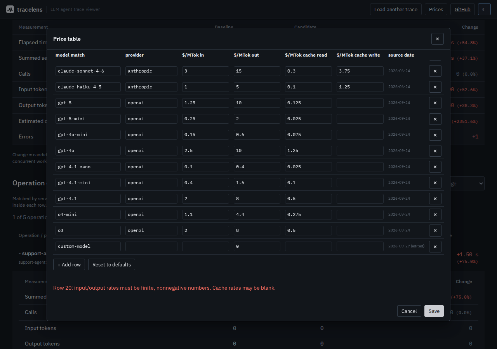

# Supported trace formats

tracelens parses **OTLP/JSON** trace exports (and Jaeger's JSON, converted to
OTLP first) and understands attributes from two independent semantic
conventions layered on top of it. This document
lists the exact attribute keys it reads, the spec versions they were
verified against, and what tracelens does when it sees neither.

All specs below were checked by fetching the cited files directly on
**2026-09-24**. Both GenAI conventions in particular are marked
"development" upstream and change between checks — re-verify before relying
on this for a new integration.

## 1. Wire format: OTLP/JSON

Source: [`opentelemetry-proto`](https://github.com/open-telemetry/opentelemetry-proto),
`opentelemetry/proto/trace/v1/trace.proto` and
`opentelemetry/proto/common/v1/common.proto` (`main` branch, checked
2026-09-24). This is the shape produced by the OpenTelemetry Collector's
`file`/`otlphttp` JSON exporters, or by `google.protobuf.json_format.MessageToJson`
on an `ExportTraceServiceRequest`.

```
{ "resourceSpans": [ { "resource": { "attributes": [ AnyValue... ] },
                        "scopeSpans": [ { "scope": {...}, "spans": [ Span... ] } ] } ] }
```

Every attribute value is a **typed `AnyValue`** union, not a bare JSON
value: `{"stringValue": "..."}`, `{"intValue": "123"}` (int64 as a decimal
string), `{"doubleValue": 1.5}`, `{"boolValue": true}`,
`{"arrayValue": {"values": [...]}}`, `{"kvlistValue": {"values": [...]}}`.
`src/core/otlp-parser.ts` → `decodeAnyValue()` decodes all six. `traceId` /
`spanId` / `parentSpanId` are lowercase hex strings; `startTimeUnixNano` /
`endTimeUnixNano` are decimal-string nanosecond timestamps (parsed as
`bigint` throughout tracelens — see `spanDurationMs()` for the one place
that narrows to a `number`, deliberately, for display). `span.kind` and
`status.code` accept either the numeric proto enum or its `SPAN_KIND_*` /
`STATUS_CODE_*` string name; both are handled.

Bare `{"resourceSpans": [...]}` and a top-level array of `resourceSpans` are
both accepted. Malformed individual spans (missing IDs, an end time before
the start time) are skipped or clamped with a warning rather than aborting
the parse — see `tests/otlp-parser.test.ts` for the exact edge cases.

Each file must contain one trace ID. Multiple trace IDs, duplicate span
IDs and cyclic parents are rejected. Missing or invalid span timestamps
are skipped with a warning; they are never silently converted to zero.
Timestamps must fit unsigned 64-bit integers. Numeric JSON timestamps
must also be safe JS integers; use decimal strings for epoch nanoseconds
to preserve precision. This restriction is stricter than a generic OTLP
decoder's numeric acceptance; see the [OTLP JSON encoding specification](https://github.com/open-telemetry/opentelemetry-proto/blob/main/docs/specification.md#json-protobuf-encoding)
(rechecked 2026-09-27).

### Jaeger JSON

A trace downloaded from the Jaeger UI ("Download JSON"), or the query API's
`/api/traces/{id}` response, is read too (`src/core/jaeger.ts`): a
`{"data": [trace]}` document or a bare trace object. Its shape comes from
Jaeger's `model/json` package. A trace is `{traceID, spans, processes}`, and a
span is `{traceID, spanID, operationName, references, startTime, duration, tags,
logs, processID}`. Note the units: `startTime` and `duration` are
**microseconds**, against OTLP's nanoseconds. Each tag is `{key, type, value}`
with `type` one of `string`, `bool`, `int64`, `float64` or `binary`.

tracelens converts the document to OTLP/JSON and then parses it like any other
export, so every check above applies. The mapping:

| Jaeger | OTLP |
|---|---|
| `startTime`, `startTime + duration` (µs) | `startTimeUnixNano`, `endTimeUnixNano` (× 1000) |
| `references`: the `CHILD_OF` span, else the `FOLLOWS_FROM` one | `parentSpanId` |
| tag `span.kind` (`client`, `server`, `producer`, `consumer`, `internal`) | `kind` |
| tag `otel.status_code`, or `error: true`; `otel.status_description` | `status` |
| tags `otel.scope.name` / `otel.scope.version` (older: `otel.library.*`) | the instrumentation scope |
| other tags | `attributes`, typed by `type` |
| `logs[]`: the `event` field (else `message`) names it, the other fields are its attributes | `events[]` |
| `processes[processID]` (or an inline `process`): `serviceName` and its tags | the resource: `service.name` plus those tags |

Jaeger has no array or map tags; its OTLP receiver stores them as JSON strings,
and they stay strings here. `examples/jaeger-genai-trace.json` is
`examples/genai-semconv-trace.json` written out by
`scripts/otlp-to-jaeger.mjs`, which shares no code with the reader.
`tests/jaeger.test.ts` checks that both files give the same span tree, times,
status, events and cost.

## 2. OpenTelemetry GenAI semantic conventions (`gen_ai.*`)

Source: [`open-telemetry/semantic-conventions-genai`](https://github.com/open-telemetry/semantic-conventions-genai),
`docs/gen-ai/gen-ai-spans.md` and `docs/gen-ai/gen-ai-events.md` (`main`
branch, checked 2026-09-24). Status: **development** — every attribute below
carries the upstream "development" stability badge, not "stable"; the base
attributes it references (`error.type`, `server.address`/`server.port`) are
from semantic-conventions `v1.44.0` and are stable. This spec superseded and
absorbed the older `gen_ai.*` conventions that used to live in
`open-telemetry/semantic-conventions`; that repo's copy now just redirects
here.

tracelens reads, per span:

| Field | Attribute(s) | Notes |
|---|---|---|
| Operation | `gen_ai.operation.name` | Drives the agent/llm/tool/embedding/retriever/chain classification — see the table in `src/core/normalize.ts` (`GENAI_OP_TO_KIND`). Well-known values: `invoke_agent`, `create_agent`, `chat`, `generate_content`, `text_completion`, `fetch_response`, `embeddings`, `execute_tool`, `retrieval`, `plan`, `invoke_workflow`, `*_memory*`. |
| Provider | `gen_ai.provider.name`, falling back to the older `gen_ai.system` | `gen_ai.system` predates `gen_ai.provider.name` in the spec's evolution and is still what most current instrumentation libraries emit; tracelens accepts either. |
| Models | `gen_ai.request.model`, `gen_ai.response.model` | |
| Agent / conversation | `gen_ai.agent.name`, `gen_ai.conversation.id` | |
| Request params | `gen_ai.request.temperature`, `gen_ai.request.max_tokens` | |
| Token usage | `gen_ai.usage.input_tokens` / `.output_tokens` (falling back to the pre-2024.11 `gen_ai.usage.prompt_tokens` / `.completion_tokens`), `gen_ai.usage.cache_read.input_tokens`, `gen_ai.usage.cache_creation.input_tokens` (also accepted as `.cache_write.input_tokens`), `gen_ai.usage.reasoning.output_tokens` | Feeds the cost calculator (§4) and the summary header's token/cost rollup. Per the spec, `input_tokens` includes both cache counts. |
| Finish reasons | `gen_ai.response.finish_reasons` | string array |
| Messages | `gen_ai.input.messages`, `gen_ai.output.messages`, `gen_ai.system_instructions` | Per spec, an array of `{"role", "parts": [{"type": "text"\|"tool_call"\|"tool_call_response", ...}]}`. Span attributes can't hold nested objects in every exporter, so tracelens accepts this either as a real structured `arrayValue`/`kvlistValue` **or** as a JSON-encoded string attribute (both are legal per spec — "MAY be recorded as a JSON string if structured format is not supported"). |
| Tool calls | `gen_ai.tool.name`, `gen_ai.tool.call.id`, `gen_ai.tool.description`, `gen_ai.tool.type`, `gen_ai.tool.call.arguments`, `gen_ai.tool.call.result` | Arguments/result: same JSON-string-or-structured handling as messages. |
| Errors | `error.type` | Combined with OTel `status.code == STATUS_CODE_ERROR` for the error count and red outline in the waterfall. |

**Legacy per-message events.** Some instrumentation built against the
2023–2024 draft never adopted `gen_ai.input.messages` / `.output.messages`
and instead emits one **span event** per turn: `gen_ai.system.message`,
`gen_ai.user.message`, `gen_ai.assistant.message`, `gen_ai.tool.message`
(each carrying a `content` attribute), and `gen_ai.choice` (carrying
`message`). tracelens falls back to reconstructing a message list from
these events when no `gen_ai.input.messages`/`.output.messages` attribute is
present — see `extractLegacyEventMessages()` in `src/core/normalize.ts`.

## 3. OpenInference conventions (`openinference.*`, `llm.*`)

Source: [`Arize-ai/openinference`](https://github.com/Arize-ai/openinference),
`spec/semantic_conventions.md` (checked 2026-09-24; the spec does not
publish a version number, so tracelens was written against whatever `main`
held on that date).

| Field | Attribute(s) |
|---|---|
| Span kind | `openinference.span.kind` — `AGENT`, `LLM`, `TOOL`, `CHAIN`, `RETRIEVER`, `EMBEDDING`, `RERANKER`, `GUARDRAIL`, `EVALUATOR`, `PROMPT` |
| Model/provider | `llm.model_name`, `llm.response.model_name`, `llm.provider`, `llm.system` |
| Token usage | `llm.token_count.prompt`, `.completion`, `.total`, `.prompt_details.cache_read`, `.prompt_details.cache_write`, `.completion_details.reasoning` |
| Messages | `llm.input_messages.<i>.message.role` / `.content`, `llm.output_messages.<i>.message.role` / `.content` — a flattened, indexed encoding (not nested JSON); tracelens regroups these by index in `extractOpenInferenceMessages()`. Falls back to the unstructured `input.value`/`output.value` pair when no indexed messages are present. |
| Tool calls | `tool.name`, `tool.description`, `tool.parameters` |
| Session | `session.id` |

## 4. Cost estimation

When both conventions occur on a span, usage is merged field by field;
an explicitly supplied OTel field takes precedence. Invalid supplied
counts remain invalid rather than falling back to another convention.
Without an explicit kind/operation, GenAI model or usage attributes are
treated as evidence of an LLM call; a tool name takes precedence. This is
a legacy-export heuristic, so producers should still supply operation names.

`src/core/pricing.ts` ships a **default price table**: every entry is either
a price this project's author verified against the vendor's own pricing
page via WebFetch (cited with URL + check date in the table itself), or it
is absent — tracelens never fabricates a number. The table is fully
editable at runtime (web UI → **Prices**) and persists to that browser's
`localStorage` only; nothing is sent anywhere. Matching is a
longest-substring, case-insensitive match against the response model
(falling back to the request model), so e.g. an entry for `gpt-4o-mini`
correctly outranks a broader `gpt-4o` entry — see `findPriceEntry()` in
`src/core/cost.ts` and its tests.

Both input and output counts must be safe, nonnegative integers to price
a call. Cached reads and writes are included in total input under the
[GenAI span conventions](https://github.com/open-telemetry/semantic-conventions-genai/blob/main/docs/gen-ai/gen-ai-spans.md#inference)
(rechecked 2026-09-27). Fresh input is total input minus both cache counts;
each component uses its own rate, with absent cache rates falling back to
the input rate. Contradictory cache totals, invalid counts and incomplete
usage leave cost unknown. This is a token-based estimate, not an invoice;
multimodal tariffs, discounts and provider-specific billing rules are not
modeled. Providers that report fresh input separately must normalize it
to total input before export.

Price rules require a nonempty model match and finite, nonnegative rates.
Zero rates are allowed explicitly. Invalid saved tables fall back to the
defaults; an intentionally empty table stays empty. Storage failures do
not prevent inspection or editing for the current session.
Editing a row clears its original source URL and records the edit date,
so the exported table does not attribute custom prices to a vendor.



## 5. Installing the CLI from git

The CLI is on npm as `@antonsoloviev/tracelens`, which is the simple route
(`npx @antonsoloviev/tracelens summary trace.json`). Installing straight from
the repository still works, and this is how:

`npm install`/`npx` on a `github:`/`git+...` spec runs the package's
`prepare` script (here, `tsc` building `dist-cli/`) inside a **project-scoped
install of the cloned repo itself**. npm 12 introduced an `allowScripts`
policy ([npm/rfcs#868](https://github.com/npm/rfcs)) that blocks lifecycle
scripts by default; passing `--allow-scripts` on the command line is
explicitly rejected in that nested, project-scoped context
(`EALLOWSCRIPTS`) — the error message says so and points at
`package.json#allowScripts` instead. `package.json` here declares
`"allowScripts": {"@antonsoloviev/tracelens": true}`, which is read during exactly that
step, so `npx --allow-git=root github:antonsoo/tracelens ...` builds and
runs without the caller needing `--allow-scripts` at all. Verified locally
end-to-end against a `git+file://` remote (this sandbox can't push to
GitHub): `npm install -g --allow-git=root --prefix <dir> git+file:///path/to/repo.git`
and plain `npx --yes --allow-git=root git+file:///path/to/repo.git summary trace.json`
both produced a working, executable `dist-cli/cli/index.js`.

## 6. "Critical path"

The critical path shown in the summary header and the CLI is a specific,
cheap heuristic, not a formal scheduling-theory critical path: starting
from the trace's longest root span, repeatedly descend into whichever
**direct child** has the largest duration. See the doc comment on
`computeCriticalPath()` in `src/core/critical-path.ts` for exactly what this
does and doesn't account for (it ignores concurrent/overlapping siblings).

## 7. Possible retries

The retry count is a heuristic: a tool call follows a failed, completed
call with the same tool name and parent. Successful repeated calls and
overlapping attempts do not count. The trace does not establish that
two calls had identical intent, so the UI labels these **possible retries**.
